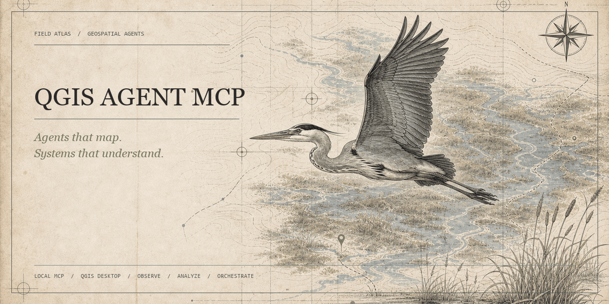
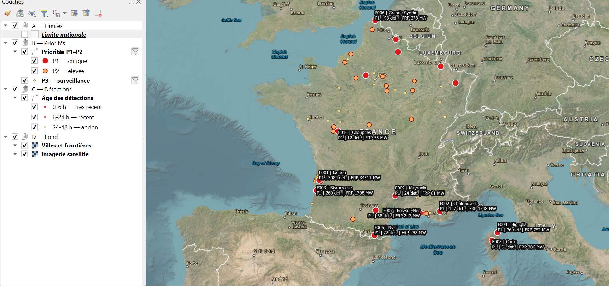
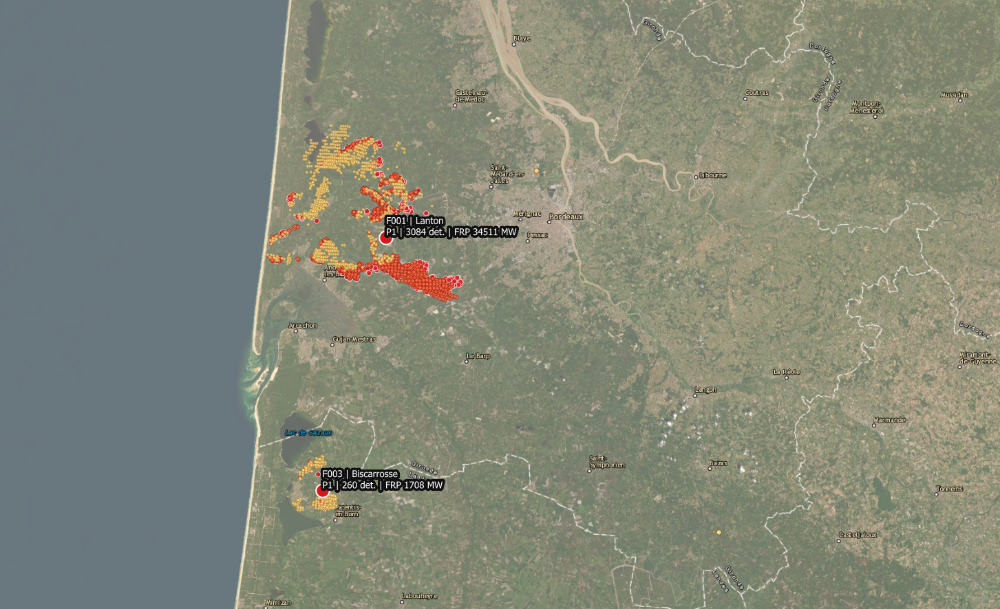
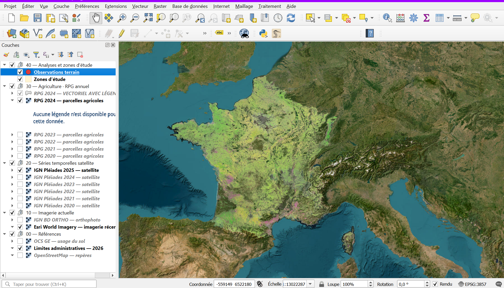
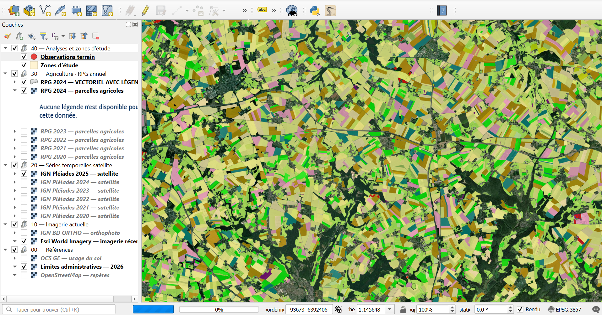
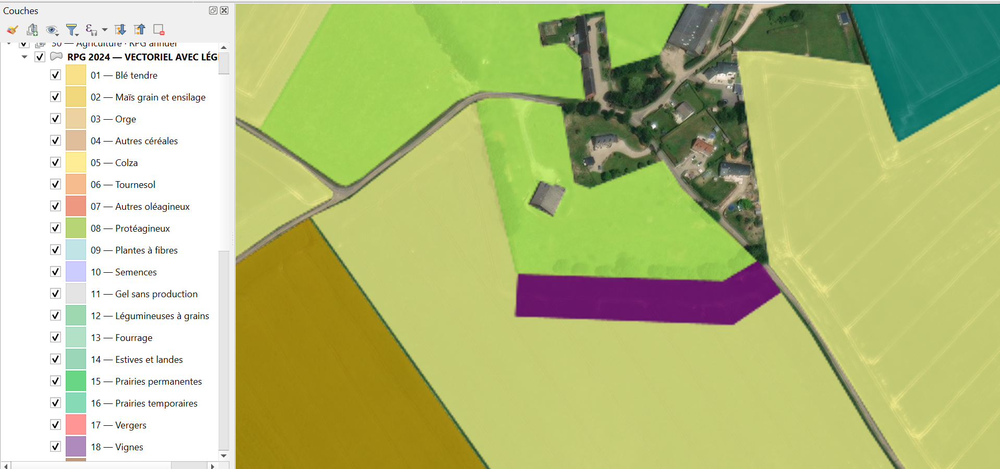

  

# QGIS Agent MCP

Connect AI agents to a live QGIS Desktop session through a secure local MCP bridge.

## Why it is different

- **100+ specialist QGIS tools** across projects, vector, raster, Processing, databases, cartography, layouts, 3D, point clouds and more.
- **Low context cost:** only 15 core/discovery tools are loaded by default; agents discover and activate specialist tools when needed.
- **One-click connection:** safely configure open-source OpenCode, Codex, Claude Code, Cursor or Google Antigravity directly from QGIS, with a universal MCP configuration for other clients.
- **Safe autonomy:** revision guards, idempotency, checkpoints, atomic workflows and recovery after a QGIS restart.
- **Visual review:** agents can inspect rendered maps, apply bounded corrections and review the result again.
- **Local by design:** authenticated loopback transport; project data stays inside QGIS.

## Install

1. Download the latest `qgis_agent_mcp-*.zip` from [Releases](https://github.com/Aaa2122/QGIS-MCP/releases).
2. In QGIS, open **Plugins → Manage and Install Plugins → Install from ZIP**.
3. Enable **QGIS Agent MCP** and click **Connect an AI client**.
4. Select **Connect / Repair** for your AI client, follow the displayed restart guidance, then reopen the client.

No port, token or configuration file needs to be copied manually.

## Try it

> Inspect this QGIS project, fix invalid layers, improve the cartography, create a print layout and visually review the final map.

The agent can also search the complete specialist catalog without loading every tool schema into its context.

## Demos: from a blank project to a finished QGIS map

Both demos start from the same clean state: a **new, empty QGIS project** with no prepared layers, styles or layout. The user connects an AI client through QGIS Agent MCP, describes the task, and the agent builds the project in the live QGIS session.

### Demo 1 — Wildfire monitoring

**Starting point:** blank QGIS project → **result:** a France-wide monitoring map with prioritized detections, age categories, labels and a focused Bordeaux view.

  
  

<em>Blank project → national overview → local detection detail</em>

### Demo 2 — Agricultural data exploration

**Starting point:** blank QGIS project → **result:** annual agricultural parcel data combined with satellite imagery, from the national view down to a detailed parcel map with a crop legend.

  
  
  

<em>Blank project → national coverage → parcel overview → detailed crop map</em>

## Safety

The bridge accepts only authenticated local connections and does not expose arbitrary Python execution. Agents use typed tools, QGIS Processing algorithms and guarded workflows instead.

## Compatibility

- QGIS 3.44 LTR through QGIS 4.x (Qt 5 and Qt 6)
- OpenCode, Codex, Claude Code, Cursor, Google Antigravity and standard stdio MCP clients
- No external Python runtime dependency in the packaged plugin
- Validated on QGIS LTR 3.44.12 and QGIS 4.2/Qt 6 with live integration scenarios

### Runtime reliability notes

- The 0.4.7 package is declared for QGIS 3.44 through 4.x, supports MCP through 2025-11-25, uses the QGIS `qgis.PyQt` compatibility layer and scoped Qt/QGIS enums, and is checked by both the official PyQGIS 4 checker and a live QGIS 4/Qt 6 integration run.
- MCP 0.4.7 keeps tool and result context bounded: every tool exposes titles, annotations and output schemas; specialist discovery includes schemas and live Processing matches; inline tool results default to 64 KiB (hard-capped at 256 KiB), with larger values retained behind byte-bounded handles or paged resources.
- The bridge bounds pending work, reserves capacity for cancellation/status calls, serializes QGIS mutations on the main thread and exposes queue timing in diagnostics. Resource updates are emitted only for subscribed URIs.
- Session snapshots reuse unchanged layer summaries; `detail=summary` avoids provider feature counts and extents, while `since_revision` returns only changed live layers plus removed layer IDs. Feature queries support bbox filters, explicit ordering, FID cursors and an independent byte budget.
- LAS/LAZ downloads and project additions use `QgsPointCloudLayer` with the PDAL provider. For classification filtering, prefer the QGIS Processing algorithm `pdal:filter` and a QGIS expression such as `"Classification" = 2` instead of invoking the PDAL CLI. The data catalog also reports known CLI constraints (`--summary`/`--metadata`, `filters.range`, forward-slash JSON paths, and optional `filters.count`).
- Processing outputs requested with `add_to_project=true` are resolved and verified as QGIS layers before success is reported. Existing output files which are loaded in the project are rejected before execution to avoid Windows file-lock failures.
- QGIS 3.44 on Windows bypasses both unsafe PyQGIS paths: MCP queues the native C++ `new3DMapCanvas` slot, then discovers the initialized canvas as an individual Qt `QWindow` instead of calling the unstable `mapCanvases3D()` list wrapper. Poll `qgis_3d_views` with `action=list` after the short initialization period; the requested name remains available as an alias for list/configure/close.
- Screenshot responses include MCP image content plus bounded structural pixel checks. Structural checks can detect blank captures, but a vision-capable client is still required for aesthetic review.

Licensed under the [MIT License](LICENSE).
